# Stage - Machine Learning et sécurité

## Présentation
Dataset : [ADNI alzheimer detection](https://www.kaggle.com/datasets/proutkarshtiwari/adni-images-for-alzheimer-detection) par [Utkarsh](https://www.kaggle.com/proutkarshtiwari)
## Analyses

## Résultats

### Attaques adversarial par inversion :

LAB en cours : [ici](./ml/algos/ARTLab)

Implémentation d'attaques **Fast Gradient Sign Method (FGSM)** et **Projected Gradient Descend (PGD)**

Caracérisation des images :
- 0: CN (Cognitively Normal)
- 1: MCI (Mild Cognitive Impairment)
- 2: EMCI (Early Mild Cognitive Impairment)
- 3: LMCI (Late Mild Cognitive Impairment)
- 4: AD (Alzheimer's Disease)

Premiers résultats :

Images après modif. par FGSM et PGD :  

**Exemple de FGSM sur images MNIST (ε=0.2)**  
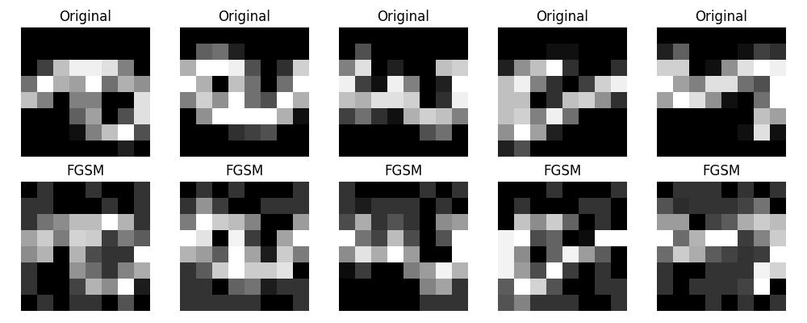

**FGSM (ε=0.2)**  
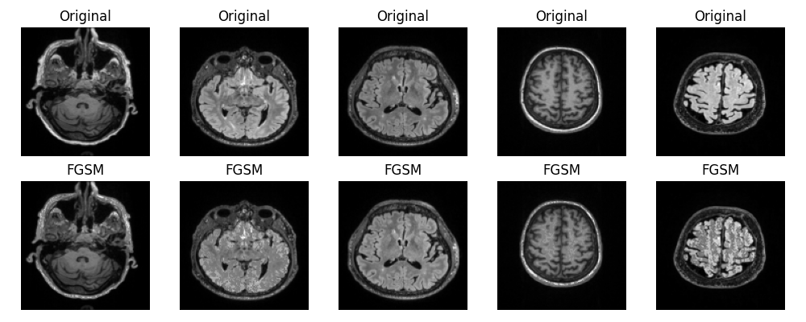

**Exemple de PGD sur images MNIST (ε=0.2) 10 ité.**  
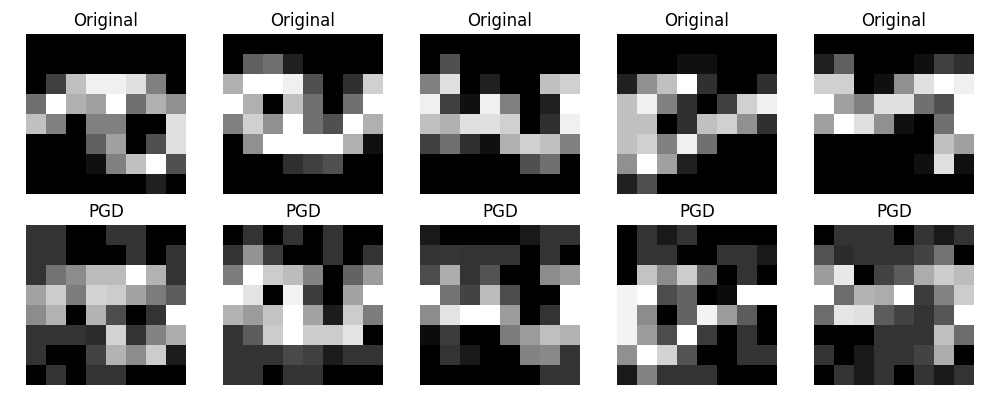

**PGD (ε=0.2) 10 ité.**  
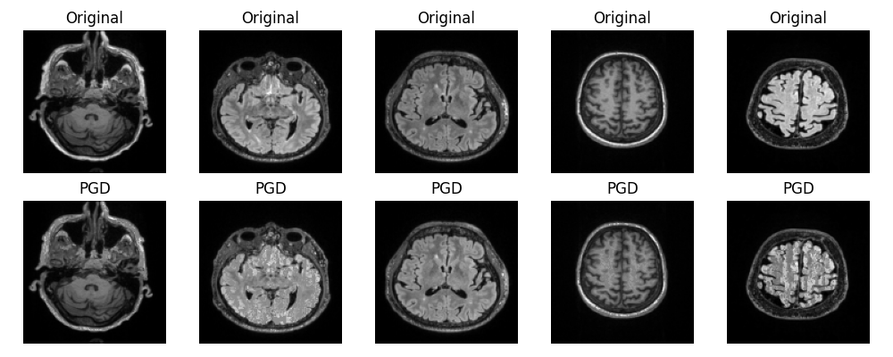

**Matrices de confusion - Clean puis post-attaques**  
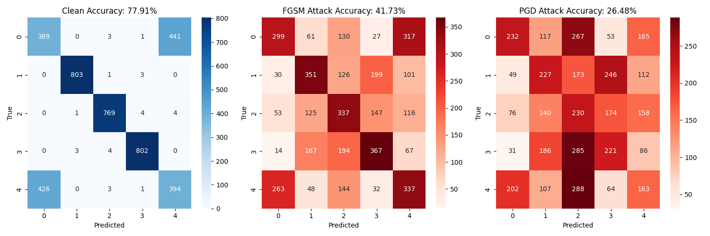
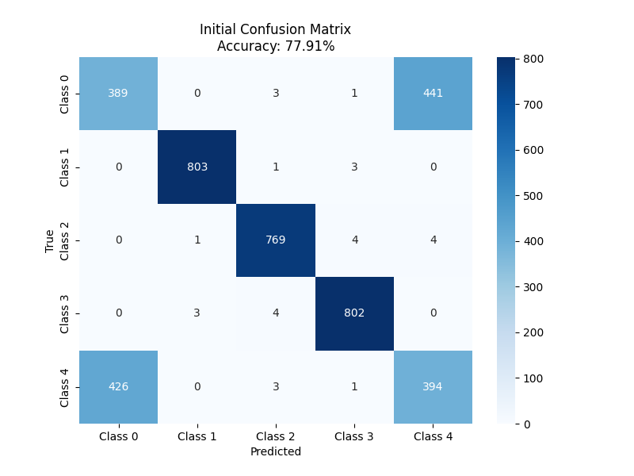
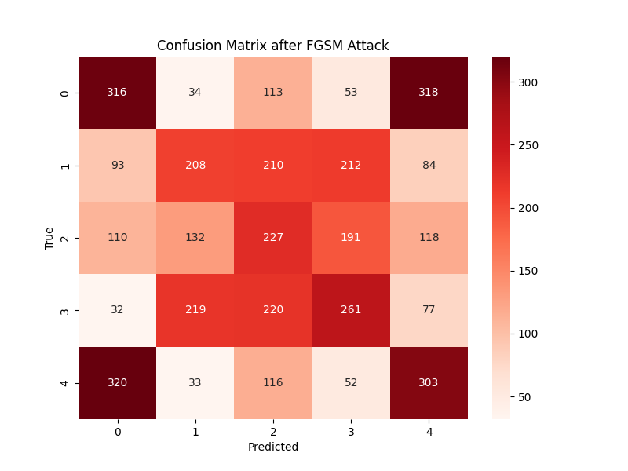
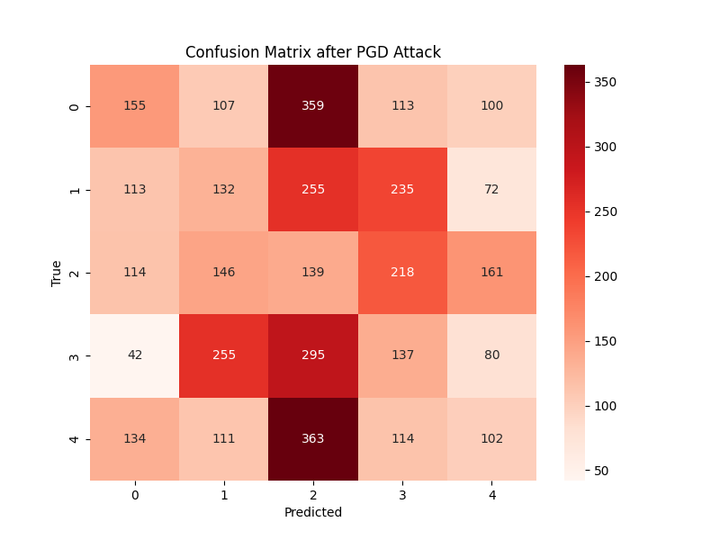

**MEP défense : adversarial training**

**Temps d'exécution comparaison**  
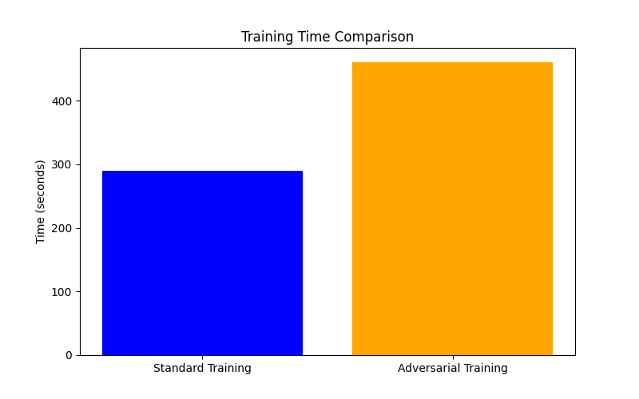

**Efficacité de la défense**  
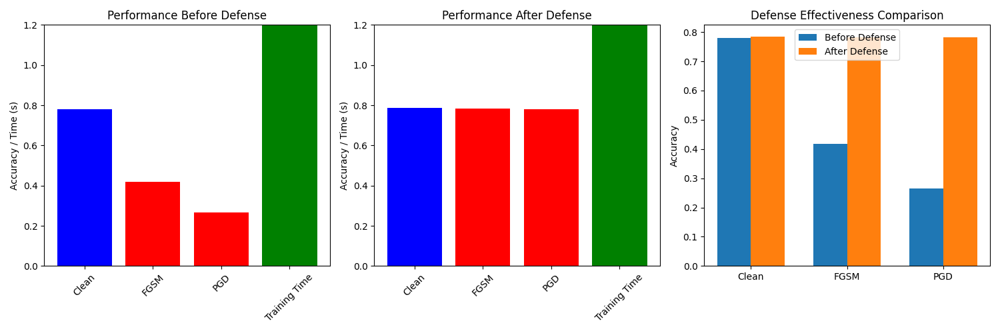

**Matrices de confusion après défense**  

**FGSM**  
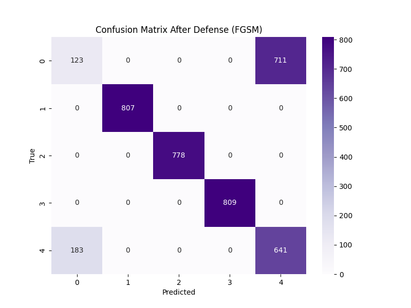
**PGD**  

## Bibliographie